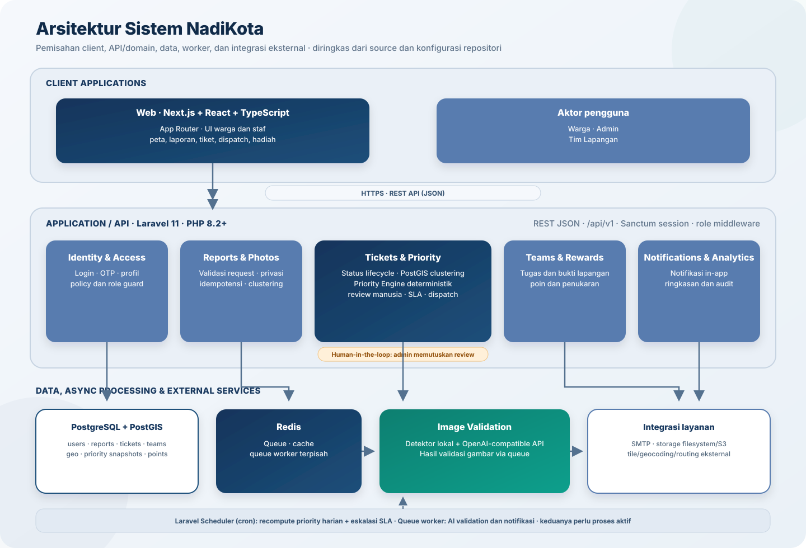
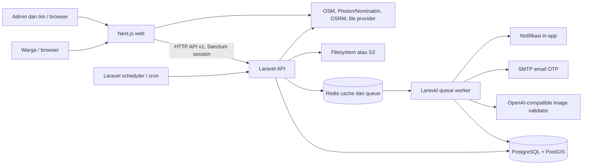
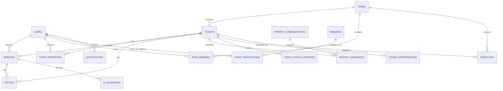
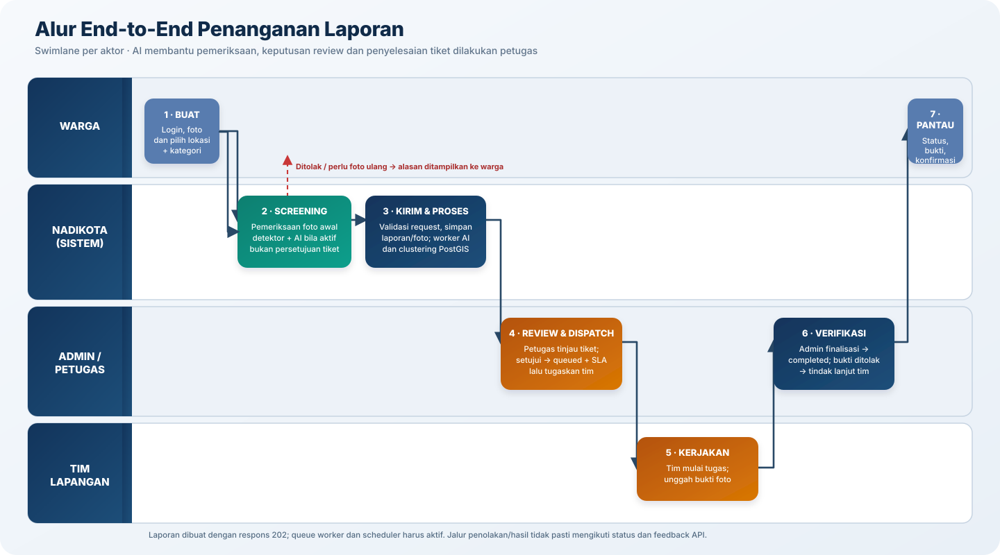
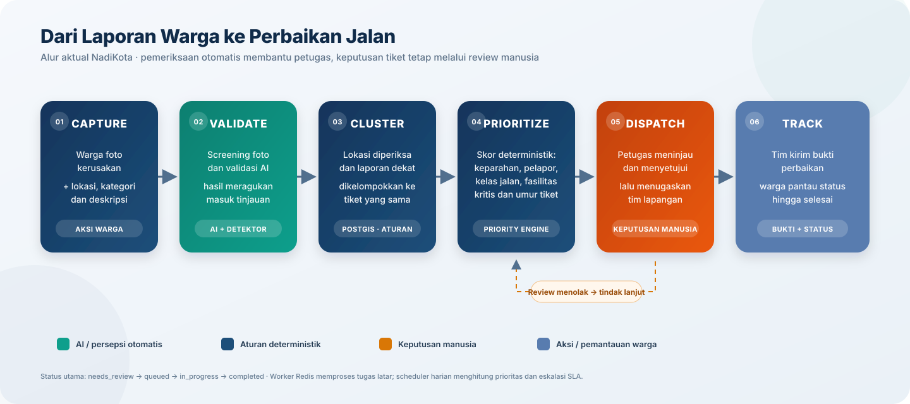
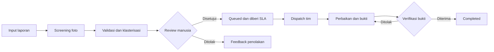
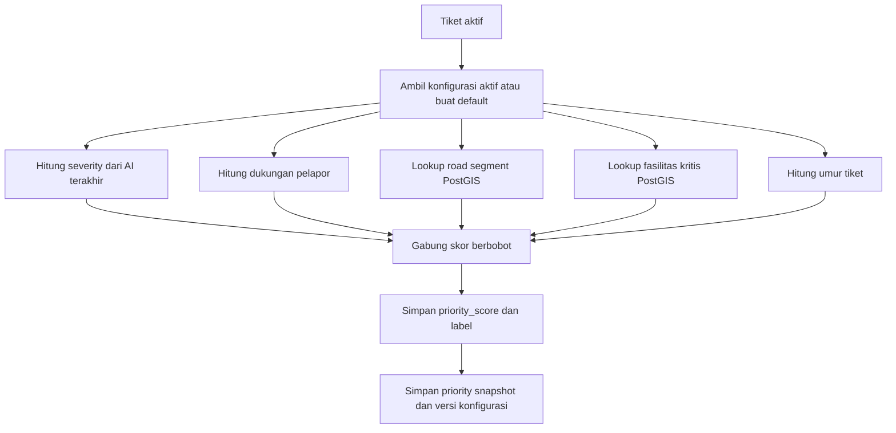
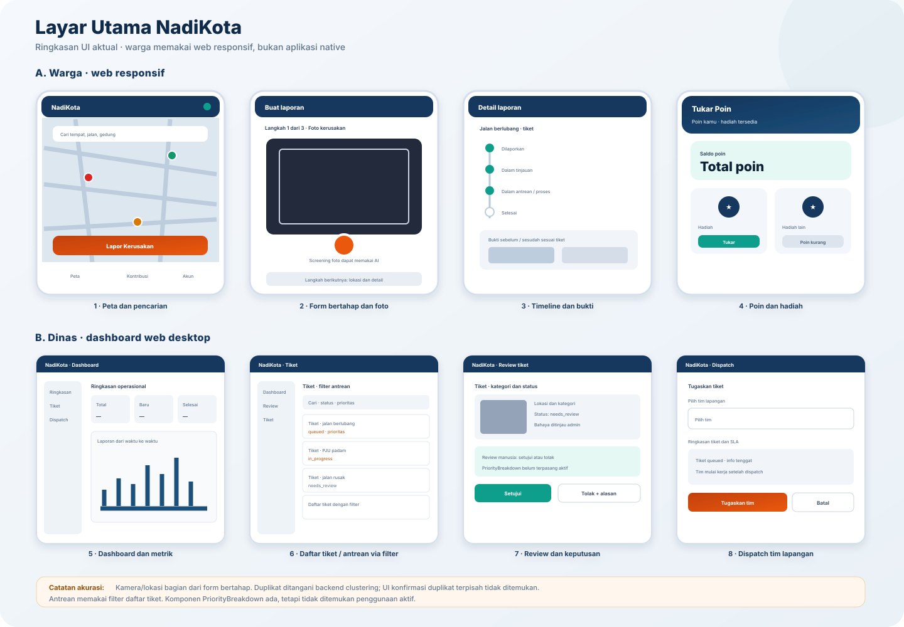
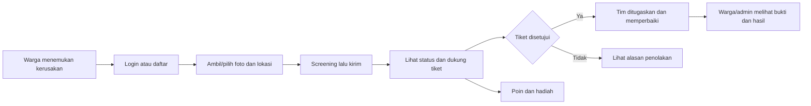

# NadiKota — Ikhtisar Proyek

> Dokumentasi ini merangkum implementasi dan konfigurasi yang tersedia di repositori pada 4 Oktober 2026. Kode aktif menjadi sumber utama jika README atau spesifikasi lama berbeda. Rahasia dan nilai `.env` tidak dicantumkan.

## Daftar Isi

1. [Tentang Aplikasi](#1-tentang-aplikasi)
2. [Fitur](#2-fitur)
3. [Cara Kerja](#3-cara-kerja)
4. [Diagram Arsitektur](#4-diagram-arsitektur)
5. [Swimlane Aktor dan Alur End-to-End](#5-swimlane-aktor-dan-alur-end-to-end)
6. [Innovation Pipeline](#6-innovation-pipeline)
7. [Priority Engine](#7-priority-engine)
8. [Arah Desain dan Hierarki Visual](#8-arah-desain-dan-hierarki-visual)
9. [Pengalaman Pengguna (UX)](#9-pengalaman-pengguna-ux)
10. [Tech Stack](#10-tech-stack)
11. [Lampiran](#11-lampiran)

---

## 1. Tentang Aplikasi

NadiKota adalah aplikasi pelaporan dan penanganan kerusakan infrastruktur perkotaan. Warga mengirim foto, kategori, deskripsi, dan lokasi; sistem menyaring laporan, menghubungkan laporan berdekatan ke tiket, lalu petugas meninjau, memprioritaskan, dan menugaskan tim. Tim lapangan mengirim bukti perbaikan; petugas memfinalisasi tiket. Sumber: `README.md`, `backend/routes/api.php`, `backend/app/Services/ReportService.php`, `backend/app/Http/Controllers/Api/V1/TicketController.php`.

| Aspek | Temuan berbasis repo |
|---|---|
| Masalah | Pelaporan kerusakan jalan, lampu jalan, dan kategori lain serta koordinasi tindak lanjut; `README.md`, `backend/config/nadi-kota.php`. |
| Target pengguna | Warga/citizen, admin/super_admin, field_team; peran juga diterapkan lewat middleware `role:*` di `backend/routes/api.php`. |
| Nilai utama | Laporan berbasis lokasi/foto, pemeriksaan otomatis, peta tiket, prioritas deterministik, penugasan tim, status dan bukti; modul terkait `ReportService`, `ValidateReportImage`, `PriorityService`, `TicketController`. |
| Status repo | Implementasi web responsif dan API aktif. Aplikasi native di `mobile/` tidak dipakai dan tidak termasuk sistem aktif yang didokumentasikan di sini. CI workflow backend ada di `backend/.github/workflows/ci.yml`. |
| Batas dokumentasi | Dokumen desain/PRD yang dirujuk sebagai artefak eksternal tidak tersedia di root saat pemeriksaan. Fitur yang tidak ditemukan ditandai eksplisit di bagian berikut. |

### Status laporan dan tiket

Laporan dan tiket memiliki status berbeda. `ReportStatus` (`backend/app/Enums/ReportStatus.php`) mencakup `submitted`, `validated`, `rejected`, `needs_review`. `TicketStatus` (`backend/app/Enums/TicketStatus.php`) mencakup `reported`, `verified`, `queued`, `in_progress`, `completed`, `rejected`, `cancelled`, `needs_review`. Alur aktual job dan controller: tiket menunggu tinjauan (`needs_review`), persetujuan admin mengantrekannya (`queued`), dispatch tidak memulai pekerjaan, tim memulai (`in_progress`), bukti menunggu verifikasi, lalu admin menyelesaikan (`completed`). README lama tidak sepenuhnya sinkron dengan implementasi ini.

## 2. Fitur

| Modul | Fitur | Aktor | Sumber implementasi |
|---|---|---|---|
| Akun & akses | Registrasi/OTP email, login password/OTP, profil/avatar, cek ketersediaan username/email, sesi Sanctum | Warga, staf | `backend/app/Http/Controllers/Api/V1/AuthController.php`, `backend/app/Services/EmailOtpService.php`, `frontend/features/auth/`, `backend/routes/api.php` |
| Pelaporan | Foto/lokasi/kategori/deskripsi, `other_description`, batas harian, idempotensi, penyimpanan foto, respons diterima untuk diproses | Warga | `frontend/app/(citizen)/report/page.tsx`, `frontend/components/report/`, `backend/app/Http/Requests/StoreReportRequest.php`, `backend/app/Services/ReportService.php` |
| Screening foto | Pemeriksaan awal sebelum submit; deteksi foto layar/recapture serta validasi gambar via layanan AI | Warga, sistem/AI | `backend/app/Http/Controllers/Api/V1/PhotoScreeningController.php`, `backend/app/Jobs/ScreenReportPhoto.php`, `backend/app/Services/RecapturedPhotoDetector.php`, `backend/app/Services/OpenAiImageValidator.php` |
| Peta & pencarian | Peta tiket, marker, pemilih basemap, pencarian tempat dan rute | Warga, publik | `frontend/app/(citizen)/peta/page.tsx`, `frontend/components/map/LocationMap.tsx`, `frontend/components/map/MapSearch.tsx`, `frontend/hooks/usePotholeVoiceAlert.ts` |
| Tiket & dukungan | Daftar/peta/detail, dukungan warga, riwayat, bukti foto, konfirmasi warga | Warga, staf | `backend/app/Http/Controllers/Api/V1/TicketController.php`, `backend/app/Policies/TicketPolicy.php`, `frontend/app/(citizen)/tickets/[id]/page.tsx`, `frontend/components/ticket/` |
| Review & prioritas | Persetujuan/penolakan, bahaya, skor prioritas dan rincian faktor | Admin | `TicketController.php`, `backend/app/Services/PriorityService.php`, `frontend/app/(staff)/review/`, `frontend/components/ticket/PriorityBreakdown.tsx` |
| Dispatch & tim | CRUD tim, pemimpin/PJ, pencarian calon PJ, penugasan terkunci, aktivasi/nonaktif | Admin, field_team | `backend/app/Http/Controllers/Api/V1/TeamController.php`, `TicketController.php`, `backend/app/Models/Team.php`, `frontend/components/dispatch/AssignTicket.tsx`, `frontend/components/team/` |
| Pelaksanaan pekerjaan | Daftar tugas, mulai, kirim foto bukti/catatan, verifikasi dan finalisasi | Field team, admin | `TicketController.php`, `frontend/app/(staff)/teams/[id]/tasks/page.tsx`, `frontend/app/(staff)/tickets/page.tsx` |
| Poin & hadiah | Perolehan poin, saldo/transaksi, katalog hadiah, penukaran, klaim dan QR | Warga, admin | `backend/app/Services/PointService.php`, `backend/app/Http/Controllers/Api/V1/PointController.php`, `backend/app/Models/Reward.php`, `frontend/components/map/TukarPoinPanel.tsx`, `frontend/app/(citizen)/hadiah/page.tsx` |
| Notifikasi & analitik | Notifikasi in-app/unread, ringkasan dan audit log | Warga, admin, staf | `backend/app/Jobs/SendTicketNotification.php`, `backend/app/Jobs/SendRoleNotification.php`, `backend/app/Http/Controllers/Api/V1/NotificationController.php`, `backend/app/Services/AnalyticsService.php` |

## 3. Cara Kerja

1. Pengguna autentikasi melalui API v1; endpoint terbuka dan endpoint terlindungi didefinisikan di `backend/routes/api.php`. Endpoint terproteksi memakai `auth:sanctum`, dan operasi staf memakai middleware peran.
2. Form web meminta kategori, foto, lokasi, dan deskripsi. `StoreReportRequest` memvalidasi masukan. `ReportService` menangani batas laporan, idempotency key, penyimpanan gambar, privasi, pencarian klaster, dan menjadwalkan validasi.
3. Screening dapat dipanggil terpisah sebelum laporan dikirim. Worker menjalankan `ScreenReportPhoto` / `ValidateReportImage`; validasi memakai detektor lokal dan validator AI yang dikonfigurasi. Kegagalan/ketidakpastian tidak otomatis dianggap persetujuan final; tiket dapat menunggu review manusia.
4. `ClusteringService` menggunakan koordinat/PostGIS untuk mengaitkan laporan yang cukup dekat dengan tiket. Relasi pelapor dan laporan disimpan agar dukungan/duplikasi dapat ditelusuri.
5. Admin meninjau tiket. Persetujuan memasukkan tiket ke `queued` dan menetapkan SLA; penolakan dicatat untuk umpan balik. Admin memilih tim untuk dispatch. `TicketController` mengunci tiket saat dispatch dan mencegah penugasan pada status yang tidak sesuai.
6. Anggota tim memulai tugas (`in_progress`), mengirim bukti/catatan. Admin dapat menolak bukti sehingga perlu perbaikan ulang, atau memfinalisasi tiket menjadi selesai.
7. Perubahan status dapat menjadwalkan notifikasi. Poin direkam sebagai transaksi; saldo dihitung dari jumlah transaksi, bukan kolom saldo mutable (`backend/app/Services/PointService.php`).
8. Scheduler Laravel menjalankan penghitungan ulang prioritas dan eskalasi SLA harian (`backend/routes/console.php`). Worker queue harus tetap aktif agar pekerjaan latar diproses.

## 4. Diagram Arsitektur

### 4.1 Tingkat tinggi





| Komponen | Tanggung jawab | Komunikasi/sumber |
|---|---|---|
| Next.js | UI publik, citizen dan staf; API client; state/query | HTTP API melalui `frontend/lib/apiClient.ts`; rute `frontend/app/` |
| Laravel | Auth, otorisasi, validasi, laporan, tiket, poin, tim, analitik | API `backend/routes/api.php`; konfigurasi `backend/bootstrap/app.php`. |
| PostgreSQL/PostGIS | Data relasional dan operasi geospasial | `backend/config/database.php`, migrasi `backend/database/migrations/nadi_kota/`. |
| Redis | Queue dan cache/session sesuai konfigurasi runtime | `backend/config/queue.php`, `backend/config/cache.php`, `backend/docker-compose.yml`. |
| Queue worker | Foto/AI, notifikasi, dan pekerjaan asinkron | `backend/app/Jobs/`, `backend/config/nadi-kota.php`. |
| AI-compatible endpoint | Validasi gambar; provider dapat diganti melalui base URL/model | `backend/app/Services/OpenAiImageValidator.php`, `backend/config/nadi-kota.php`. Model bukan Priority Engine. |
| Peta/geocoding/routing | Basemap, pencarian, reverse geocoding, rute | `frontend/components/map/`, `README.md`; layanan eksternal dapat memiliki batas ketersediaan/rate-limit. |
| Email/storage | OTP dan foto/avatar | `backend/config/mail.php`, `backend/config/filesystems.php`, `backend/app/Services/EmailOtpService.php`. |

### 4.2 Relasi data inti

Diagram diringkas dari model dan migration. Kolom di bawah menunjukkan relasi utama, bukan seluruh kolom tabel.



Sumber relasi: `backend/app/Models/{User,Report,Ticket,Team,PointTransaction,Reward,PrioritySnapshot}.php` dan migration `backend/database/migrations/nadi_kota/`. Tabel `road_segments` dan `critical_facilities` menyediakan data geo untuk prioritas; relasi Eloquent yang eksplisit tidak ditemukan untuk keduanya.

## 5. Swimlane Aktor dan Alur End-to-End



```mermaid
sequenceDiagram
    actor W as Warga
    participant UI as Web
    participant API as Laravel API
    participant DB as PostgreSQL/PostGIS
    participant Q as Redis queue + worker
    participant AI as Validator AI
    actor A as Admin
    actor T as Tim lapangan

    W->>UI: Isi kategori, foto, lokasi, deskripsi
    UI->>API: Screening foto (opsional sebelum submit)
    API->>Q: Jadwalkan screening
    Q->>AI: Periksa gambar (bila konfigurasi/provider tersedia)
    AI-->>Q: Hasil screening atau error provider
    Q-->>UI: Hasil dapat diambil lewat endpoint screening
    W->>UI: Kirim laporan
    UI->>API: POST /api/v1/reports + idempotency
    API->>DB: Validasi, simpan laporan/foto, cari klaster
    API-->>UI: 202 diterima / 4xx validasi / error
    API->>Q: Jadwalkan validasi gambar
    Q->>AI: Validasi gambar
    alt AI menerima atau hasil perlu tinjauan
        AI-->>Q: Skor/kategori/keparahan
        Q->>DB: Simpan validasi; tiket menunggu review bila belum disetujui admin
    else Provider gagal atau hasil tidak tegas
        AI-->>Q: Timeout/error/hasil tak pasti
        Q->>DB: Simpan status/error sesuai job; retry atau tinjauan
    end
    A->>API: Review tiket
    API->>DB: Persetujuan -> queued + SLA, atau penolakan
    A->>API: Dispatch tim
    API->>DB: Lock tiket dan simpan penugasan
    T->>API: Mulai tugas; kirim bukti
    API->>DB: Status in_progress dan bukti
    alt Bukti diterima
        A->>API: Finalisasi
        API->>DB: completed + riwayat
    else Bukti ditolak
        A->>API: Tolak bukti dengan alasan
        API->>DB: Tetap perlu tindak lanjut tim
    end
    API-->>W: Status/notifikasi dan riwayat
```

Jalur auth/otorisasi yang gagal menghasilkan respons API sesuai exception handler (`backend/bootstrap/app.php`). Validasi request menggunakan format error project. Detail retry dan hasil final setiap kegagalan integrasi bergantung pada job dan konfigurasi queue; tidak semua provider outage mempunyai fallback sinkron yang sama.

## 6. Innovation Pipeline

**Pipeline inovasi bernama tidak ditemukan di kode atau routing.** Tidak ada bukti modul pengajuan ide, evaluasi inovasi, stage gate pengembangan, atau peluncuran eksperimen. Diagram berikut memperbaiki visual referensi menjadi pipeline operasional laporan yang benar-benar ada, bukan mengklaim fitur innovation management.





| Tahap yang terimplementasi | Kriteria perpindahan | Input → output | Sumber |
|---|---|---|---|
| Pengajuan | Request lolos validasi, kuota dan autentikasi | Foto/lokasi/deskripsi → laporan dan tiket | `StoreReportRequest.php`, `ReportService.php` |
| Screening/validasi | Hasil detektor/validator; threshold di konfigurasi; ketidakpastian dapat ditinjau | Foto → hasil screening/AI validation | `ScreenReportPhoto.php`, `ValidateReportImage.php`, `config/nadi-kota.php` |
| Review | Keputusan admin | Tiket review → `queued` atau `rejected` | `TicketController::review()` |
| Dispatch | Tiket memenuhi status dan tim valid | Tiket + tim → dispatch | `TicketController::dispatch()` |
| Bukti/finalisasi | Bukti ditinjau admin | Foto/catatan → diterima (`completed`) atau ditolak untuk tindak lanjut | `TicketController.php` |

Kriteria inovasi produk lintas tahap: **Belum terdokumentasi / tidak ditemukan di kode.**

## 7. Priority Engine

`PriorityService` adalah mesin deterministik lima faktor, bukan model AI. Skor faktor berskala 0–100 dan digabung memakai bobot konfigurasi aktif (`backend/app/Services/PriorityService.php`, `backend/app/Models/PriorityConfiguration.php`). Bobot default: severity 30%, pelapor 20%, road class 20%, proximity 15%, umur 15% (`PriorityService::createDefaultConfiguration()`). Konfigurasi admin dapat dikelola lewat `ConfigurationController` dan migrasi konfigurasi.

### Faktor dan normalisasi

| Faktor | Skor faktor dari kode | Bobot default |
|---|---|---:|
| Keparahan AI terakhir | critical=100, high=80, moderate=50, low=20; tanpa hasil=50 | 30% |
| Jumlah pelapor unik | `min(reporterCount / 10, 1) * 100` | 20% |
| Kelas jalan | arterial=100, collector=70, local=40; tak ditemukan=50 | 20% |
| Dekat fasilitas kritis | dalam radius pencarian 500 m: `(1 - distance/500) * 100`, dibatasi minimum 0; tidak ditemukan/lokasi tak ada=0 | 15% |
| Umur tiket | `min(ageDays / 30, 1) * 100` | 15% |

Rumus implementasi:

```text
score = round(
  severityScore * severityWeight / 100
  + reporterScore * reportersWeight / 100
  + roadScore * roadClassWeight / 100
  + proximityScore * proximityWeight / 100
  + ageScore * ageWeight / 100,
  4
)
```

Kode memakai default weight saat key konfigurasi hilang: `severity ?? 30`, `reporters ?? 20`, `road_class ?? 20`, `proximity ?? 15`, `age ?? 15`. Snapshot faktor dan versi konfigurasi disimpan untuk audit.

### Label, batas dan override

- `score >= 70` → `urgent`; `score >= 30` → `waiting`; selain itu → `completed` (`PriorityService::determineLabel()`). Label `completed` untuk skor rendah tampak tidak selaras secara semantik; dokumentasi ini mencatat perilaku aktual, bukan menyatakan maksud bisnis. Perlu konfirmasi pemilik produk.
- Tiket aktif yang dihitung ulang: `reported`, `verified`, `queued`, `in_progress`; dijadwalkan harian oleh `routes/console.php` melalui `nadi:recompute-priority`.
- Bobot/ambang konfigurasi tersimpan dengan versi. Snapshot merekam faktor; kode tidak menunjukkan tie-breaker skor lintas tiket.
- Override manual atas `priority_score`/`priority_label`: **Belum terdokumentasi / tidak ditemukan di kode** sebagai jalur terpisah. Admin dapat meninjau dan menetapkan `danger_level`, yang bukan hal sama dengan skor PriorityService.

### Alur penentuan



### Contoh hitung

Contoh ilustratif memakai bobot default dan masukan faktor eksplisit; nilai tidak diklaim sebagai tiket produksi.

1. **Kasus A**: severity 80, 5 pelapor → reporter 50, arterial 100, jarak fasilitas 100 m → proximity 80, umur 15 hari → age 50. Skor = `80×0.30 + 50×0.20 + 100×0.20 + 80×0.15 + 50×0.15 = 72.5`; label kode `urgent`.
2. **Kasus B**: severity 20, 1 pelapor → reporter 10, local 40, tidak ada fasilitas dalam radius → proximity 0, umur 3 hari → age 10. Skor = `20×0.30 + 10×0.20 + 40×0.20 + 0×0.15 + 10×0.15 = 17.5`; label kode `completed` (pemetaan mencurigakan seperti catatan di atas).

## 8. Arah Desain dan Hierarki Visual

### Prinsip yang terlihat

- Token warna semantik dan kontras status didefinisikan di `frontend/app/globals.css` serta `frontend/lib/theme.ts`.
- Palet utama: navy `primary-800` (`18 52 91`), teal `accent-500` (`15 159 140`), netral slate; status success/danger/warning/info masing-masing punya token.
- Fokus keyboard global memakai `:focus-visible` dengan outline 3 px dan ring teal. Scrollbar dapat disembunyikan tanpa mematikan scroll. Reduced-motion dipakai pada beberapa animasi komponen.
- Font family/typography scale khusus: **Belum terdokumentasi / tidak ditemukan di kode tema yang ditinjau**; halaman menggunakan utility Tailwind seperti `text-*`, `font-*`, `leading-*`.
- Ikon menggunakan `lucide-react` dan `react-icons` di web (`frontend/package.json`).

### Hierarki halaman



| Halaman/layar | Fokus visual dan tujuan | Sumber |
|---|---|---|
| Peta (`/peta`) | Peta sebagai konteks utama; pencarian, legenda, marker, navigasi; panel kontribusi/poin membuka dari navigasi | `frontend/app/(citizen)/peta/page.tsx`, `frontend/components/map/` |
| Form laporan (`/report`) | Langkah form, foto dan lokasi, validasi sebelum kirim | `frontend/app/(citizen)/report/page.tsx`, `frontend/components/report/` |
| Detail tiket | Status, kategori, lokasi, riwayat/bukti | `frontend/app/(citizen)/tickets/[id]/page.tsx`, `frontend/components/ticket/` |
| Dashboard/review/dispatch | Daftar dan ringkasan operasional untuk admin | `frontend/app/(staff)/`, `frontend/components/dashboard/`, `frontend/components/dispatch/` |
| Tugas tim | Tiket yang ditugaskan dan aksi mulai/kirim bukti | `frontend/app/(staff)/teams/[id]/tasks/page.tsx` |
| Tukar poin/hadiah | Saldo, biaya hadiah, konfirmasi, riwayat/QR klaim | `frontend/components/map/TukarPoinPanel.tsx`, `frontend/app/(citizen)/hadiah/page.tsx` |
| Tim/pengaturan | Kelola tim, pemimpin, akun dan preferensi | `frontend/components/team/`, `frontend/app/(staff)/settings/page.tsx` |

Aset logo web/PWA ada di `frontend/public/`. Tidak ditemukan spesifikasi formal spacing grid atau design-system lengkap.

## 9. Pengalaman Pengguna (UX)

### Segmen dan journey

Persona formal tidak ditemukan; segmen berikut disimpulkan langsung dari peran implementasi.



| Area UX | Implementasi yang ditemukan | Sumber |
|---|---|---|
| Navigasi | Sidebar desktop dan bottom nav pada viewport kecil; role-based menu; guard perubahan halaman saat form belum selesai | `frontend/components/nav/SidebarNav.tsx`, `BottomNavBar.tsx`, `frontend/lib/navigationGuard.ts` |
| Loading/kosong/error | Skeleton, EmptyState, ErrorState, toast, offline banner | `frontend/components/ui/` |
| Form & offline | Kamera preview, validasi schema, konfirmasi meninggalkan form; outbox lokal laporan | `frontend/components/report/`, `frontend/lib/reportOutbox.ts`, `frontend/hooks/useOnlineStatus.ts` |
| Responsif | Cabang breakpoint desktop dan viewport kecil, panel full-screen atau modal/bottom sheet dalam web | `frontend/app/`, `frontend/components/`, `frontend/hooks/useIsMobile.ts` |
| Aksesibilitas | `aria-label`, `aria-pressed`, role dialog, focus-visible; `Modal` mengelola Escape/focus trap | `frontend/components/ui/Modal.tsx`, `frontend/app/globals.css`, komponen panel |
| Voice alert | Web Speech API memperingatkan lubang di sekitar rute | `frontend/hooks/usePotholeVoiceAlert.ts`, `frontend/lib/speak.ts` |

**Friction yang tampak dari implementasi, bukan hasil riset pengguna:** alur tiket bergantung pada worker dan scheduler yang harus aktif; foto/AI dan geocoding bergantung layanan eksternal; endpoint peta memakai layanan publik dengan batas ketersediaan; status `needs_review` menunggu tindakan admin; laporan offline disimpan sebagai outbox, namun sinkronisasi dan konflik harus diuji pada kondisi jaringan nyata. Saran: tampilkan status antrean/background job yang transparan, pantau worker/provider, dan lakukan uji usability serta audit WCAG. Tidak ditemukan laporan usability/WCAG formal.

## 10. Tech Stack

| Kategori | Teknologi / versi yang dinyatakan dependency | Alasan yang tampak |
|---|---|---|
| Web frontend | Next.js `16.3.5`, React `19.2.8`, TypeScript `^5`, Tailwind CSS `^4` | App Router, rendering web, typed UI dan utility styling; `frontend/package.json`. |
| Web data/state | TanStack Query `^5.103.2`, Zustand `^5.0.15`, Axios `^1.20.0`, React Hook Form `^7.88.0`, Zod `^4.6.5` | Query/cache, state UI, HTTP dan form/schema; `frontend/package.json`. |
| Peta web | MapLibre GL `^6.10.0`, Leaflet `^1.9.4`, React Leaflet `^5.0.0` | Peta dan rendering geospasial; `frontend/package.json`. |
| Backend | PHP `^8.2`, Laravel `^11.0`, Sanctum `^4.3`, Predis `^3.6` | REST/API, autentikasi session dan Redis; `backend/composer.json`. |
| Database | PostgreSQL + PostGIS; versi container PostGIS image di `backend/docker-compose.yml` | Relasi dan query spasial (`ST_DWithin`, `ST_Distance`). Versi produksi tidak dinyatakan di kode. |
| Queue/cache | Redis; image versi di `backend/docker-compose.yml` | Queue job, cache dan infrastruktur lokal. |
| AI/ML | OpenAI-compatible HTTP endpoint; model/base URL runtime dari env | Validasi gambar via `OpenAiImageValidator`; versi model aktual tidak dicantumkan di repo karena environment-specific. |
| Testing | Pest `^2.36`, PHPUnit `^10.5`; ESLint `^9`; TypeScript `^5` web | Feature/unit backend; web lint/typecheck. `backend/composer.json`, `frontend/package.json`. |
| CI/CD | GitHub Actions workflow backend | Detail job dari `backend/.github/workflows/ci.yml`; workflow frontend **tidak ditemukan**. |
| Monitoring | Laravel logging dan audit logs; stack observability terkelola | Solusi APM/metrics/alerting **tidak ditemukan di kode**. |

## 11. Lampiran

### 11.1 Struktur folder

```text
NadiKota/
├── backend/                  # Laravel API, domain, queue, migrations, tests
│   ├── app/                  # Controllers, models, policies, services, jobs
│   ├── config/               # Konfigurasi Laravel dan domain nadi-kota
│   ├── database/             # Migrations, factories, seeders
│   ├── docs/                 # OpenAPI (cek konsistensi dengan routes/api.php)
│   ├── routes/               # API, web, scheduler
│   └── tests/                # Pest feature/unit
├── frontend/                 # Next.js App Router
│   ├── app/                  # Route groups citizen/staff
│   ├── components/           # UI, map, report, team, ticket, navigation
│   ├── features/             # Auth, reports, dashboard, notifications
│   ├── hooks/                # Hooks browser/domain
│   ├── lib/                  # API client, stores, utilitas
│   └── public/               # Logo, PWA, aset statis
├── Markdown/                 # Dokumen desain/PRD/SAD/readiness
├── tmp/                      # File sementara lokal; tidak untuk release
├── README.md                 # Orientasi dan instruksi awal
└── PROJECT_OVERVIEW.md       # Dokumen ini
```

### 11.2 Menjalankan lokal

Ikuti script/config yang tersedia dan jalankan dependency manager di subfolder; root bukan package frontend.

```bash
# Infrastruktur lokal
cd backend
docker compose up -d postgres redis

# Backend — siapkan backend/.env dari backend/.env.example
composer install
php artisan key:generate
php artisan migrate
php artisan serve

# Terminal backend terpisah untuk background jobs
php artisan queue:work redis --queue=ai-validation,notifications,default
php artisan schedule:work

# Frontend
cd ../frontend
npm install
npm run dev
```

Folder `mobile/` tidak digunakan untuk aplikasi aktif ini. Perintah/config environment produksi yang lengkap: **Belum terdokumentasi sebagai IaC di repo**. Periksa `backend/README.md` dan `frontend/README.md` untuk instruksi komponen terbaru.

### 11.3 Environment variables

Daftar berikut diringkas dari `backend/.env.example`, `backend/config/*.php`, dan konfigurasi frontend aktif. Nama dapat berubah; **nilai rahasia sengaja tidak dicantumkan**.

| Kelompok | Nama variabel yang dibaca kode | Tujuan |
|---|---|---|
| Laravel dasar | `APP_NAME`, `APP_ENV`, `APP_KEY`, `APP_DEBUG`, `APP_URL`, `LOG_*` | Boot, URL, enkripsi dan logging; `backend/config/app.php`, `logging.php`. |
| Database | `DB_CONNECTION`, `DB_HOST`, `DB_PORT`, `DB_DATABASE`, `DB_USERNAME`, `DB_PASSWORD`, `DATABASE_URL` (jika driver/env menggunakannya) | Koneksi PostgreSQL; `backend/config/database.php`. |
| Redis/cache/session/queue | `REDIS_*`, `CACHE_*`, `SESSION_*`, `QUEUE_CONNECTION` | Cache, session dan antrean; `backend/config/{database,cache,session,queue}.php`. |
| CORS/Sanctum | `CORS_ALLOWED_ORIGINS`, `SANCTUM_STATEFUL_DOMAINS`, `SESSION_DOMAIN`, `SESSION_SECURE_COOKIE` | Browser stateful session; `backend/config/{cors,sanctum,session}.php`. |
| Mail/OTP | `MAIL_*`, `OTP_LENGTH`, `OTP_EXPIRY_MINUTES`, `OTP_MAX_ATTEMPTS`, `OTP_RATE_LIMIT_PER_HOUR` | Pengiriman OTP dan batas percobaan; `backend/config/{mail,nadi-kota}.php`. |
| AI | `OPENAI_MODEL`, `OPENAI_BASE_URL`, `AI_TIMEOUT_SECONDS`, `AI_MAX_DAILY_CALLS`, `AI_PROMPT_VERSION`, `AI_ACCEPTED_MIN_CONFIDENCE`, `AI_REJECTED_MAX_CONFIDENCE`, `AI_REPHOTO_SCORE_THRESHOLD`, `AI_REPHOTO_EDGE_DARK_RATIO`, `AI_REPHOTO_PERIODIC_CORRELATION` | Provider/model, ambang dan deteksi recapture; `backend/config/nadi-kota.php`, `backend/config/services.php`. Kredensial provider jangan dicatat di dokumen. |
| Geo/operasi | `CLUSTERING_RADIUS_METERS`, `GEO_MIN_LAT`, `GEO_MAX_LAT`, `GEO_MIN_LNG`, `GEO_MAX_LNG`, `GEO_EXIF_MISMATCH_METERS`, `GEO_IP_MISMATCH_KM`, `GEO_IP_LOOKUP_URL` | Klaster, area valid dan sinyal lokasi; `backend/config/nadi-kota.php`. |
| SLA/rate/photo/points | `SLA_BUSINESS_HOURS`, `SLA_DAYS_POTHOLE`, `SLA_DAYS_STREET_LIGHT`, `SLA_DAYS_OTHER`, `SLA_ESCALATION_DAY1_ROLE`, `SLA_ESCALATION_DAY3_ROLE`, `SLA_ESCALATION_DAY5_ROLE`, `REPORTS_PER_USER_PER_DAY`, `REPORTS_PER_IP_PER_MINUTE`, `PHOTO_MAX_SIZE_BYTES`, `POINTS_REPORT_ACCEPTED` | SLA, rate limit, ukuran foto dan poin; `backend/config/nadi-kota.php`. |
| Frontend | `NEXT_PUBLIC_*` yang benar-benar direferensikan `frontend/` | URL/API dan opsi build frontend. Daftar lengkap perlu diekstrak dari referensi aktif; `.env` tidak dimasukkan. |

> **Catatan:** kelompok tidak berarti setiap deployment wajib mengisi semua variabel. Gunakan `.env.example` dan file config sebagai daftar otoritatif; jangan menyalin kredensial ke issue, commit, atau dokumentasi.

### 11.4 Batasan, utang teknis, dan ketidakpastian

- README dan kode berbeda pada perpindahan status setelah validasi AI; ikuti `TicketStatus`, `ValidateReportImage`, dan `TicketController` sampai README diselaraskan.
- `PriorityService::determineLabel()` memetakan skor `<30` ke `completed`; verifikasi maksud sebelum perubahan bisnis.
- `backend/docs/openapi.yaml` perlu dibandingkan ulang dengan route dan auth aktual; dokumentasi OpenAPI dapat tertinggal.
- Pipeline manajemen inovasi, persona riset, aturan typographic/spacing lengkap, audit WCAG, dan friction tervalidasi pengguna: **Belum terdokumentasi / tidak ditemukan di kode/dokumen yang diperiksa**.
- Dependensi layanan eksternal (AI, SMTP, geocoding, basemap, routing) dan worker/scheduler menambah titik kegagalan; konfigurasi timeout/retry tersedia sebagian di `backend/config/nadi-kota.php` dan `backend/config/queue.php`.
- Versi layanan produksi, topologi lengkap, kebijakan backup/retensi, observability/APM, serta prosedur disaster recovery: **Belum terdokumentasi / tidak ditemukan sebagai konfigurasi deployment di repo**.
- Test backend ada di `backend/tests/`; cakupan otomatis frontend tidak tampak dalam manifest yang diperiksa. Keberadaan test tidak menjamin semua alur diuji.
