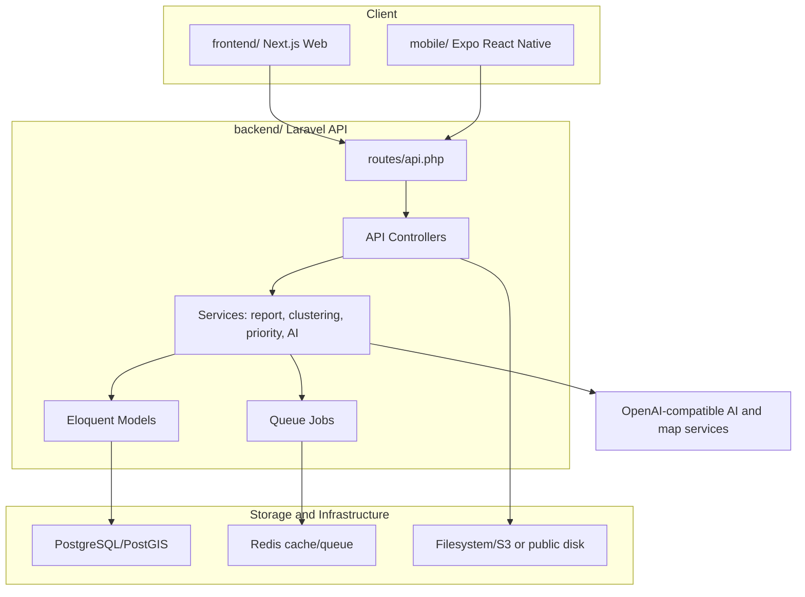
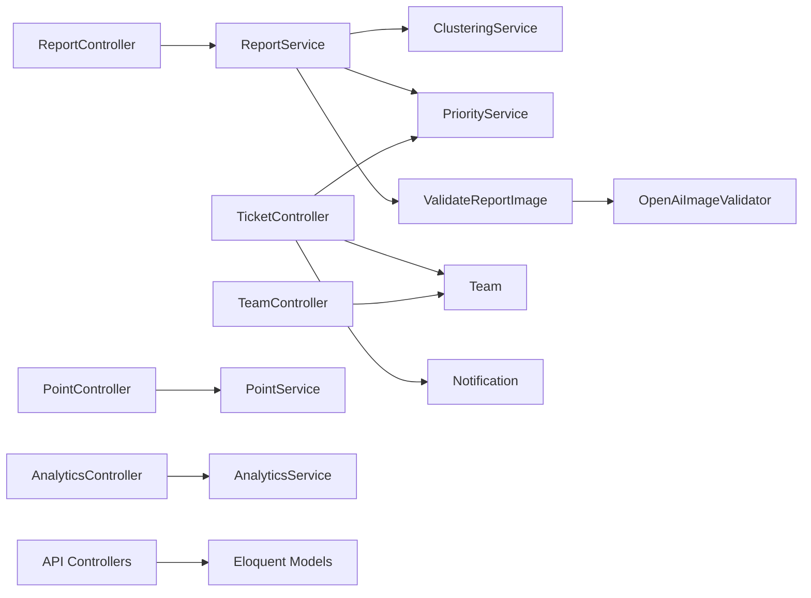
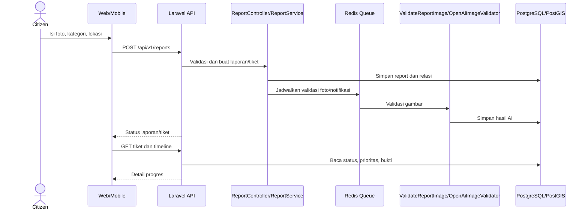
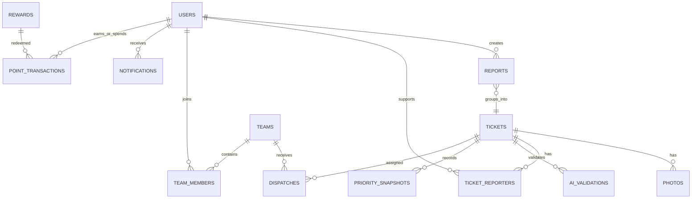

# Dokumentasi Project NadiKota

> Dokumen disusun dari isi workspace `C:\NadiKota`. Folder hasil generate/dependency seperti `node_modules`, `.next`, `.expo`, `vendor`, `storage`, `build`, `dist`, `__pycache__`, dan `.git` tidak dijadikan sumber utama.

## 1. Ringkasan Project

**Nama:** NadiKota (`README.md`, `CONCEPT PAPER.md`).

NadiKota adalah sistem pelaporan kerusakan infrastruktur kota. Warga mengirim laporan kerusakan jalan atau penerangan jalan umum dengan foto dan lokasi. Sistem melakukan screening/validasi foto, mengelompokkan laporan berdekatan, menghitung prioritas, lalu mendukung peninjauan admin, penugasan tim lapangan, pengiriman bukti perbaikan, dan penyelesaian tiket (`README.md`; `backend/app/Services`; `backend/app/Http/Controllers/Api/V1`).

Masalah yang ditangani adalah laporan yang tersebar dan duplikat, kualitas foto/lokasi yang tidak seragam, serta prioritas perbaikan yang sulit ditentukan secara konsisten (`CONCEPT PAPER.md`, bagian 1.1 dan 1.3).

Target pengguna berdasarkan route, middleware, dan UI adalah:

- **Citizen/warga:** membuat laporan, melihat status, mendukung tiket, melihat peta, mengelola profil, dan memakai poin/hadiah (`backend/app/Enums/UserRole.php`; `frontend/app/(citizen)`).
- **Admin/super admin/petugas dinas:** meninjau tiket, mengatur prioritas, melakukan dispatch, mengelola tim, hadiah, konfigurasi, audit log, dan analitik (`backend/routes/api.php`; `frontend/app/(staff)`).
- **Field team/tim lapangan:** melihat tugas, memulai pekerjaan, dan mengirim bukti (`backend/routes/api.php`; `frontend/app/(staff)/teams/[id]/tasks`).

## 2. Jenis & Teknologi

| Area | Bukti teknologi | Versi yang ditemukan |
|---|---|---|
| Backend | Laravel, PHP, API JSON, Sanctum | Laravel `^11.0`, PHP `^8.2` (`backend/composer.json`) |
| Backend database | PostgreSQL/PostGIS | PostgreSQL/PostGIS 16/3.4 pada `backend/docker-compose.yml`; koneksi PostgreSQL pada `backend/.env.example` |
| Cache/queue | Redis dan Predis | Redis 7 Alpine; `predis/predis ^3.6` (`backend/docker-compose.yml`, `backend/composer.json`) |
| Auth | Laravel Sanctum, OTP/password login, Socialite dependency | Sanctum `^4.3`, Socialite `^5.31` (`backend/composer.json`, `backend/routes/api.php`) |
| AI | Adapter OpenAI-compatible multimodal image validator | Model/base URL dibaca konfigurasi (`backend/config/nadi-kota.php`, `backend/app/Services/OpenAiImageValidator.php`) |
| Backend quality | Pest/PHPUnit, Pint, Larastan | Pest `^2.36`, PHPUnit `^10.5`, Pint `^1.13`, Larastan `^3.12` (`backend/composer.json`) |
| Web | Next.js App Router, React, TypeScript, Tailwind CSS | Next `16.3.5`, React `19.2.8`, TypeScript `^5`, Tailwind `^4` (`frontend/package.json`) |
| Web state/data | TanStack Query, Zustand, Axios, React Hook Form, Zod | Versi tercantum di `frontend/package.json` |
| Web map | MapLibre GL, Leaflet/React Leaflet | MapLibre `^6.10.0`, Leaflet `^1.9.4` (`frontend/package.json`) |
| Mobile | Expo React Native, expo-router, MapLibre RN | Expo `~57.0.25`, React Native `0.86.3` (`mobile/package.json`) |
| CI | GitHub Actions | Lint, static analysis, PostgreSQL/Redis integration test (`backend/.github/workflows/ci.yml`) |

Jenis project ditentukan dari tiga aplikasi dalam satu repository: Laravel API (`backend/`), Next.js web (`frontend/`), dan Expo React Native (`mobile/`).

## 3. Fitur Utama

1. **Autentikasi dan profil:** register, verifikasi OTP, login password, session, logout, ubah profil/password/avatar (`backend/routes/api.php`, `AuthController.php`).
2. **Pelaporan kerusakan:** laporan foto dan lokasi melalui endpoint `/api/v1/reports` (`ReportController.php`, `StoreReportRequest.php`, `frontend/components/report`).
3. **Screening foto:** pemeriksaan awal dan pengambilan hasil screening (`PhotoScreeningController.php`, `PhotoScreeningTest.php`).
4. **Validasi AI asinkron:** job `ValidateReportImage`, adapter `OpenAiImageValidator`, konfigurasi threshold, timeout, retry, dan prompt version (`backend/app/Jobs/ValidateReportImage.php`, `backend/config/nadi-kota.php`).
5. **Penggabungan laporan dekat:** `ClusteringService` memakai radius konfigurasi (`backend/app/Services/ClusteringService.php`, `backend/config/nadi-kota.php`).
6. **Prioritas deterministik:** `PriorityService`, snapshot prioritas, kelas jalan, fasilitas kritis, pelapor, keparahan, dan umur tiket (`backend/app/Services/PriorityService.php`, migration `create_priority_snapshots_table.php`).
7. **Siklus tiket:** `reported → needs_review → queued → in_progress → completed`, dengan review, dispatch, start, complete, finalize, pembatalan, dan penolakan bukti (`README.md`, `backend/routes/api.php`, `TicketStatus.php`).
8. **Manajemen tim:** CRUD tim, anggota, PJ/leader, aktivasi, reset password, dan dispatch (`TeamController.php`, `backend/app/Models/Team.php`).
9. **Bukti perbaikan dan konfirmasi warga:** bukti foto/catatan, review bukti, dan konfirmasi (`TicketController.php`, migration tiket dan `citizen_confirmations`).
10. **Peta dan navigasi:** marker tiket, pencarian/geocoding, rute, dan peringatan suara jalan berlubang di web (`README.md`, `frontend/app/(citizen)/peta`, `frontend/components/map`).
11. **Notifikasi:** daftar, jumlah belum dibaca, tandai dibaca, serta job notifikasi berbasis peran (`NotificationController.php`, `SendRoleNotification.php`).
12. **Poin dan hadiah:** saldo, transaksi, redeem, CRUD hadiah admin (`PointController.php`, `RewardController.php`, `PointService.php`).
13. **Dashboard dan audit:** ringkasan analitik, audit log, konfigurasi admin (`AnalyticsController.php`, `ConfigurationController.php`).

## 4. Arsitektur Project (Mermaid)

### 4.1 Arsitektur tingkat tinggi



Diagram menunjukkan dua client yang mengakses API Laravel. Controller memakai service dan model; queue memakai Redis; model menyimpan data ke PostgreSQL/PostGIS. Integrasi AI dan layanan peta berasal dari konfigurasi/kode yang ditemukan, bukan layanan baru yang diasumsikan (`README.md`, `backend/docker-compose.yml`, `backend/routes/api.php`).

### 4.2 Hubungan modul nyata



Relasi menggambarkan kelas yang ada di `backend/app/Http/Controllers/Api/V1`, service/job di `backend/app/Services` dan `backend/app/Jobs`, serta model yang dipakai untuk persistensi.

### 4.3 Skenario pengiriman laporan



Alur didasarkan pada route report, job validasi, service report, model/migration, dan konfigurasi queue (`backend/routes/api.php`, `backend/app/Jobs`, `backend/app/Services/ReportService.php`). Detail urutan internal yang tidak eksplisit pada satu fungsi perlu konfirmasi melalui eksekusi aplikasi.

## 5. Struktur Folder

```text
C:\NadiKota
├── backend/              Laravel API, domain, migration, test, CI
│   ├── app/              Controller, service, job, model, policy, enum
│   ├── config/           Konfigurasi Laravel dan NadiKota
│   ├── database/         Migration, factory, seeder, SQLite file
│   ├── routes/           Route API/web/console
│   ├── tests/            Test Pest feature dan unit
│   ├── docs/             OpenAPI menurut README; keberadaan perlu verifikasi lebih lanjut
│   └── docker-compose.yml PostgreSQL/PostGIS dan Redis
├── frontend/             Next.js web client
│   ├── app/               Route App Router public, citizen, staff
│   ├── components/        Komponen auth, report, map, ticket, team, UI
│   └── package.json       Dependency dan script web
├── mobile/               Expo React Native client
├── CONCEPT PAPER.md      Latar belakang, rancangan, dan prinsip solusi
├── README.md             Stack, alur, setup, peta, notifikasi
├── LICENSE               Lisensi repository
└── PROJECT_OVERVIEW.md   Dokumen ini
```

Folder `tmp/`, log tunnel, dan file dependency/generated ada di workspace, tetapi tidak menjadi bagian arsitektur runtime yang didokumentasikan di sini.

## 6. Alur Kerja Sistem

1. Client melakukan autentikasi melalui endpoint auth.
2. Warga mengisi kategori, foto, dan lokasi; validasi request dan rate limit diterapkan.
3. Foto dapat melalui endpoint screening sebelum laporan dikirim.
4. Backend membuat laporan/tiket dan menjadwalkan proses AI/notifikasi melalui queue Redis.
5. Validasi AI menghasilkan keputusan seperti accepted, suspicious, atau rejected; laporan tidak otomatis menjadi antrean hanya karena lolos AI (`README.md`, `AiDecision.php`).
6. Laporan dekat dengan kategori sama dapat diklaster; jumlah pelapor menjadi sinyal prioritas.
7. Admin meninjau, memberi tingkat bahaya, menyetujui/menolak, lalu melakukan dispatch ke tim.
8. Tim lapangan menekan mulai, mengerjakan, dan mengirim foto/catatan bukti.
9. Admin menilai bukti; bukti dapat ditolak atau tiket difinalisasi.
10. Warga memantau timeline, memberi dukungan/konfirmasi, dan memperoleh poin sesuai aturan.

```mermaid
flowchart TD
  A["Laporan warga"] --> B["Screening foto"]
  B --> C["Simpan report/tiket"]
  C --> D["AI validation via queue"]
  D --> E{ "Keputusan dan review" }
  E -->|rejected| X["Feedback/rejected"]
  E -->|needs_review| F["Review admin"]
  F -->|approved| G["Clustering dan priority"]
  G --> H["Dispatch ke tim"]
  H --> I["Tim mulai dan bekerja"]
  I --> J["Kirim bukti"]
  J --> K{ "Review bukti" }
  K -->|ditolak| I
  K -->|diterima| L["Finalize/completed"]
  L --> M["Notifikasi, timeline, poin/konfirmasi"]
```

## 7. Penjelasan Modul/Komponen

| Modul | Fungsi dan input-output | Hubungan |
|---|---|---|
| `AuthController` | Menerima kredensial/OTP dan mengembalikan session/user | Dipakai client dan Sanctum |
| `ReportController` | Menerima request laporan, menampilkan report | Memakai request, policy, service, model |
| `TicketController` | Membaca dan mengubah lifecycle tiket, dispatch, bukti, konfirmasi | Terhubung team, priority, notification, model tiket |
| `PhotoScreeningController` | Menjalankan dan mengambil hasil screening foto | Terhubung auth, throttle, job/service foto |
| `TeamController` | CRUD tim, PJ, status, reset password, pencarian user | Memakai `Team`, `TeamMember`, policy |
| `ReportService` | Orkestrasi pembuatan/penanganan laporan | Menghubungkan clustering, priority, AI, persistensi |
| `ClusteringService` | Menemukan/menyatukan laporan dekat | Menggunakan lokasi dan kategori tiket |
| `PriorityService` | Menghitung skor/label prioritas dan snapshot | Menggunakan konfigurasi, road segment, critical facility |
| `OpenAiImageValidator` | Adapter validator gambar AI | Implementasi `AiImageValidator`, dipanggil job |
| `ValidateReportImage` | Queue job validasi foto dengan retry/timeout konfigurasi | Redis queue, validator, model AI |
| `SendRoleNotification` / `SendTicketNotification` | Membuat notifikasi untuk peran/tiket | Notification model dan endpoint notification |
| `PointService` | Mengelola transaksi poin dan redeem | Reward, PointTransaction, user |
| Client route/components | UI citizen/staff, form, peta, timeline, dashboard | Memanggil API melalui Axios/TanStack Query/Zustand |

## 8. Data & Penyimpanan

### 8.1 Penyimpanan

- **PostgreSQL/PostGIS:** database utama untuk user, report, ticket, AI validation, photo, priority, team, dispatch, road segment, fasilitas kritis, notifikasi, reward, poin, audit, dan histori status (`backend/database/migrations/nadi_kota`).
- **Redis:** cache/queue untuk job validasi AI dan notifikasi (`backend/docker-compose.yml`, `backend/config/queue.php`, `README.md`).
- **Filesystem/S3:** penyimpanan foto; pilihan disk dikonfigurasi melalui `FILESYSTEM_DISK` (`backend/config/filesystems.php`, `backend/.env.example`).
- **API eksternal:** OpenAI-compatible endpoint untuk validator AI; Photon/Nominatim/OSRM disebut untuk peta/geocoding/rute (`README.md`).

### 8.2 Entitas utama

| Entitas | Isi/peran | Sumber |
|---|---|---|
| `users` | Identitas, role, profil, kredensial | migration users, `User.php` |
| `reports` | Laporan warga, kategori, lokasi, status/hasil validasi | `create_reports_table.php`, `Report.php` |
| `tickets` | Unit kerja yang diklaster, status, bahaya, assignee, bukti | `create_tickets_table.php` dan migration lanjutan |
| `ai_validations` | Keputusan, confidence, hasil validasi | `create_ai_validations_table.php` |
| `photos` | Foto laporan/bukti | `create_photos_table.php` |
| `ticket_reporters` | Relasi pelapor unik dan tiket | migration ticket reporters |
| `priority_snapshots` | Faktor/skor/label prioritas pada waktu tertentu | migration priority snapshots |
| `teams`, `team_members`, `dispatches` | Tim, anggota, penugasan tiket | migration terkait |
| `road_segments`, `critical_facilities` | Data geospasial pendukung prioritas | migration terkait |
| `notifications`, `ticket_status_histories`, `audit_logs` | Notifikasi, histori, dan audit | migration terkait |
| `rewards`, `point_transactions` | Hadiah dan mutasi poin | migration 2026-09-25 |



ERD merangkum foreign-key/domain relationships yang tercermin dari nama tabel, model, dan migration. Kolom detail lengkap tetap berada di migration masing-masing.

## 9. Konfigurasi & Environment

Variabel utama yang ditemukan:

- `DB_*`, `REDIS_*`, `FILESYSTEM_DISK`, `QUEUE_CONNECTION` untuk database, queue, cache, dan foto (`backend/.env.example`, `backend/config/*`).
- `OPENAI_API_KEY`, `OPENAI_BASE_URL`, `OPENAI_MODEL`, timeout, batas harian, prompt version, dan threshold AI (`backend/.env.example`, `backend/config/nadi-kota.php`).
- `CLUSTERING_RADIUS_METERS`, `SLA_*`, `REPORTS_PER_USER_PER_DAY`, `REPORTS_PER_IP_PER_MINUTE`, batas foto, OTP, dan bounding box geografi (`backend/config/nadi-kota.php`).
- Konfigurasi web/mobile tambahan perlu dibaca dari file environment masing-masing; tidak ada dokumentasi lengkap yang ditemukan di root README.

**Catatan keamanan:** file `backend/.env` dan `backend/.env.testing` ada di workspace serta memuat nilai credential/API. Nilainya sengaja tidak ditampilkan. Credential nyata perlu dirotasi bila pernah terekspos dan tidak boleh dimasukkan ke dokumentasi.

## 10. Cara Instalasi & Menjalankan

Langkah berikut berasal dari `README.md`:

```bash
cd backend
docker compose up -d postgres redis
composer install
cp .env.example .env
php artisan key:generate
php artisan migrate
php artisan serve
php artisan queue:work redis --queue=ai-validation,notifications,default
```

Web:

```bash
cd frontend
npm install
npm run dev
```

Mobile opsional:

```bash
cd mobile
npm install
npx expo start
```

Backend default disebut berjalan di `http://localhost:8000`, frontend di `http://localhost:3000` (`README.md`). Build production, konfigurasi deploy, dan prosedur rilis tidak ditemukan secara lengkap di workspace.

## 11. Pengujian & Kualitas

Test backend ditemukan di `backend/tests/Feature` dan `backend/tests/Unit`, mencakup AI validation, screening foto, lokasi spoof, recaptured photo, report API, poin, team dispatch, prompt AI, dan example test. Perintah utama:

```bash
cd backend
php artisan test
```

CI menjalankan:

- `vendor/bin/pint --test` untuk style.
- `vendor/bin/phpstan analyse --no-progress` untuk static analysis.
- `vendor/bin/pest --coverage --min=0` untuk test dengan PostgreSQL/PostGIS dan Redis (`backend/.github/workflows/ci.yml`).

Frontend menyediakan `npm run lint`; mobile menyediakan `npm run lint` (`frontend/package.json`, `mobile/package.json`). Coverage aktual dan hasil test terakhir tidak dapat dipastikan tanpa menjalankan suite.

## 12. Keterbatasan & Catatan

- Tidak ditemukan hasil eksekusi test/build pada saat penyusunan dokumen; status runtime perlu konfirmasi.
- Model AI, kualitas confidence, dan ketersediaan endpoint OpenAI-compatible bergantung environment (`backend/config/nadi-kota.php`).
- `backend/.env` memuat credential sensitif; jangan dibagikan atau dijadikan sumber nilai konfigurasi dokumentasi.
- `docker-compose.yml` berisi password development yang tertulis langsung; gunakan secret management untuk deployment.
- README menyebut `backend/docs/openapi.yaml`, tetapi keberadaan/isi file tersebut perlu konfirmasi dari workspace aktif.
- Detail urutan internal beberapa service, skema kolom lengkap, dan hubungan foreign key harus dirujuk langsung ke migration/model sebelum dijadikan spesifikasi kontraktual.
- Map/geocoding/routing memakai layanan eksternal tanpa API key menurut README; availability, rate limit, dan kebijakan layanan tidak dijelaskan.
- File generated/dependency cukup besar dan terdapat `tmp/` serta log tunnel; pengelolaan artefak tersebut tidak dijelaskan.
- Konfigurasi `FILESYSTEM_DISK` berbeda antara contoh environment (`s3`) dan environment lokal yang ditemukan (`public`); deployment perlu memilih secara eksplisit.

## 13. Saran Pengembangan

1. Rotasi credential yang pernah tersimpan pada `.env`, pindahkan secret ke secret manager, dan pastikan `.env` tidak masuk version control.
2. Tambahkan dokumentasi deployment, environment web/mobile, kontrak API, dan contoh konfigurasi non-rahasia.
3. Jalankan test, lint, static analysis, dan build pada environment bersih; simpan hasil CI sebagai bukti kualitas.
4. Tambahkan test untuk seluruh transisi status, idempotensi queue job, kegagalan AI, upload storage, dan authorization tiap role.
5. Tambahkan observability untuk queue, latency AI, kegagalan geocoding/routing, serta audit perubahan konfigurasi.
6. Validasi dan indeks data geospasial secara eksplisit untuk menjaga performa clustering dan peta pada data besar.
7. Pisahkan konfigurasi development dari production, terutama password database, filesystem, AI endpoint, rate limit, dan SLA.

## 14. Poin yang Perlu Dikonfirmasi

- Apakah `backend/docs/openapi.yaml` tersedia dan sinkron dengan `backend/routes/api.php`?
- Apakah mobile sudah mengimplementasikan seluruh flow yang tersedia di web/API atau masih subset?
- Apakah endpoint AI pada `OPENAI_BASE_URL` adalah gateway internal/proxy dan model yang digunakan sudah final?
- Database production menggunakan PostGIS dan object storage apa, serta bagaimana backup/retention-nya?
- Apakah `tunnel.err.log`, `tmp/`, dan credential pada environment merupakan artefak development yang harus dihapus/dirotasi?
- Berapa coverage test aktual, dan apakah `npm run build` frontend serta build Expo berhasil pada environment target?
- Apakah layanan Photon, Nominatim, dan OSRM yang disebut README memiliki endpoint/configuration yang dapat dipastikan dari source?
- Apakah aturan poin, SLA, bobot prioritas, dan radius clustering telah disetujui pemilik proses atau masih prototipe?
